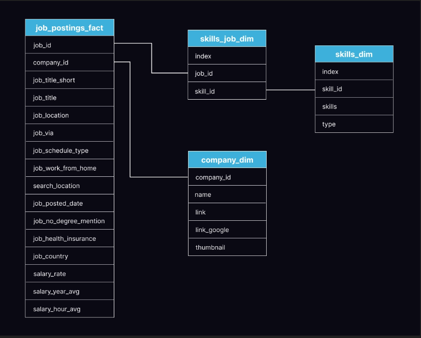
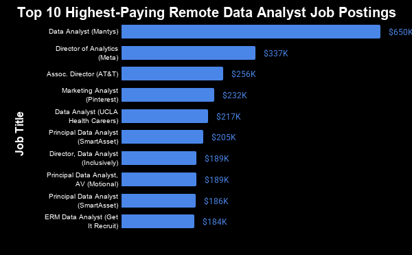
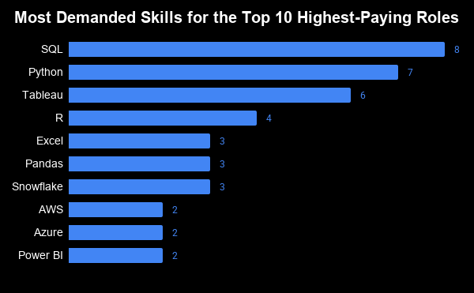
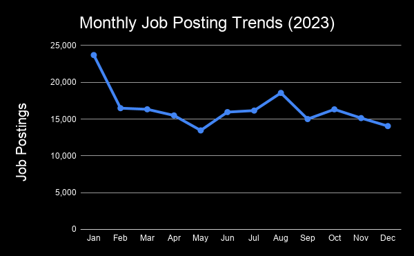

# Executive Summary
This project analyses over 195,000 Data Analyst job postings from 2023. Using SQL, the insights include salary trends, hiring demand and the most valuable skills needed for these roles.

## Key Findings
- The Top-paying salaries range from **$184K** to **$650K**, with roles offered by companies in telecommunications (AT&T), Technology (Meta, Pinterest) and Artificial Intelligence (Motional).
- SQL, Python and Tableau appear the most amongst the high-paying salary jobs, suggesting the core analytics tools remain highly valued by employers. 
- SQL, Excel and Python are the most desired skills by employers in Data Analyst job postings, highlighting their importance regardless of salary.
- Specialised technologies like PySpark, Watson and Couchbase are associated with the highest-paying salaries, but are sought after in only one or two job postings, indicating these skills are highly niche.
- January contained the highest number of Job postings, while May contained the fewest. These conclusions provide insight into the hiring trends during 2023, but should not be extrapolated as long-term trends.

# Introduction
Hi, I'm Abu-Bakr, and I have a Master's degree in Physics from the University of Birmingham. After working as a Maths and Science tutor, I'm transitioning into data analytics. To begin this journey, I've been building my SQL skills through hands-on projects that use real-world datasets and demonstrate practical analysis techniques. 

In this project, I analysed the 2023 data analyst job market using SQL to investigate salary trends, in-demand skills and hiring patterns. The dataset contains job postings from around the world, providing the opportunity to explore global demand and identify key insights for both employers and aspiring analysts.

This project was completed as part of Luke Barousse's SQL for Data Analytics course, where I gained experience writing SQL queries using JOINs, Common Table Expressions (CTE), Aggregate functions, Date Functions and other fundamental techniques. 

The repository contains the SQL queries, visual graphs and tables, and written analyses, in addition to the methodology and key insights.
### SQL Queries

All SQL queries used for this project can be found here:

[View SQL queries](project_sql/)

# Project Motivation
The motivation behind this project was to equip and understand the skills most valued for a career in data analysis. By analysing real-world datasets, I aimed to find at the skills that are most in-demand and have the largest return on investment, making my job search more effective. 

The dataset used includes information on job titles, locations, companies, posting dates, and required skills.

Using SQL and other tools, I set out to answer the following questions:
1. What are the highest-paying data analyst jobs?
2. Which skills are commonly required for these high-paying positions?
3. Which skills are most demanded among employers?
4. What are the most optimal skills to learn that offfer job security, high salary and high demand?
5. During which months are the most Data Analyst jobs advertised?

# Tools I used
In this project, I utilised a various number of tools to conduct my analysis:   
- **SQL (Structured Query Language):** The core language used to query databases, analyse datasets, and answer the project questions.
- **PostgreSQL:** Acting as a relational databse management system, PostgreSQL allowed me to store, query, and manipulate the data efficiently.
- **Visual Studio Code:** The primary development tool used for writing, organising and executing SQL scripts. Also used for project documentation.
- **Google Sheets:** Visualises the findings into tables and charts that display the results of the analysis.
- **Git:** Used to track and manage changes throughout the project.
- **Github:** Used to host the Git repository, share the queries and findings, and showcase the project.

# Database structure
The database contains four tables, all with unique purposes. They will all be utilised throughout the project to conduct the analysis and answer the project questions.



*Figure 1: Databse schema showing relationships between the four tables used in this project. Source: Luke Barousse, SQL for Data Analytics course.* 

The `job_postings_fact` table is the central table, linking to both company information and the required skills for every posting.

# The Analysis
Each query in this project was carried out with the intention of investigating specific aspects of the data job market, specifically Remote Data Analyst roles.

## 1. Top paying Remote Data Analyst Jobs

In order to identify the highest paying Data Analyst job postings that were available remotely, the dataset  was filtered based on the average yearly salary and also the option to work from home. The results showcase the postings with the highest paying opportunities in the field.

```sql
-- Joining job_postings_fact with company_dim to obtain the company name for each job posting.
SELECT 
    job_id,
    job_title,
    job_location,
    job_schedule_type,
    salary_year_avg,
    job_posted_date,
    name as company_name
FROM 
    job_postings_fact
LEFT JOIN company_dim on job_postings_fact.company_id = company_dim.company_id

-- Filtering for Data Analyst roles with non-null salaries and remote work options, then ordering by salary to find the top-paying jobs.
WHERE
    job_title_short = 'Data Analyst' 
    AND job_work_from_home = True
    AND salary_year_avg IS NOT NULL
ORDER BY 
    salary_year_avg DESC
LIMIT 10
```
*Query 1: Retrieving the highest-paying remote Data Analyst jobs (2023).*

**Data Schema Note:** As the dataset categorises various roles under the `job_title_short` label of `'Data Analyst'`, this query successfully captures specialised roles that still fall within the data analytics postings.



*Figure 2: The Top 10 Job Postings with the highest salaries.*

### Key Findings
- **Wide Salary Range**: The Top 10 high-paying data analyst roles span from $184,000 to $650,000, indicating high-earning potential for data analysts in the remote market.
- **Diverse Employers**: Organisations ranging from tech giants (Meta, Pinterest) to major telecommuncations firms (AT&T) are offering these high salaries, demonstrating that they are wiling to offer competitive salaries for expertise in Data Analytics.
- **Job Title Variety**: Despite the search focusing solely on Data Analyst roles, the postings include many specialties within data analytics, from Marketing Analyst to ERM Data Analyst.

While the majority of the Top 10 postings fall between **$184K and $256K**, the posting for **Mantys ($650K)** is a significant outlier. This suggests that a small number of specialised postions offer much higher salaries compared to other high-paying Data Analyst jobs.

## 2. Skills Required for the Highest-Paying Jobs.
This second query follows directly from the first, only this time there is a focus on the skills required for these high paying roles. This insight allows one to understand the skills they should prioritise learning to be hired for these higher-paid roles.

```sql
-- Finding the Top-10 Highest Paying Remote Data Analyst Jobs.
WITH top_paying_jobs AS (
SELECT 
    job_id,
    job_title,
    salary_year_avg,
    name as company_name
FROM 
    job_postings_fact
LEFT JOIN company_dim on job_postings_fact.company_id = company_dim.company_id
WHERE
    job_title_short = 'Data Analyst' 
    AND salary_year_avg IS NOT NULL
    AND job_work_from_home =  True
ORDER BY 
    salary_year_avg DESC
LIMIT 10
)

-- Joining the top-paying jobs with skills_job_dim and skills_dim to get the required skills for these roles. Ordering to show the highest-paying jobs first.
SELECT
    top_paying_jobs.*,
    skills_dim.skills
FROM
    top_paying_jobs
INNER JOIN 
    skills_job_dim ON top_paying_jobs.job_id = skills_job_dim.job_id
INNER JOIN 
    skills_dim ON skills_job_dim.skill_id = skills_dim.skill_id
ORDER BY
    top_paying_jobs.salary_year_avg DESC

```
*Query 2: Obtaining the count of postings for the skills required for the ten highest-paying Data Analyst roles.*

This second query makes use of Query 1 in the form of a Common Table Expression (CTE) to identify the highest-paying jobs. This CTE joins with the skills tables to retrieve the skills and the aggregate function `COUNT()` the number of postings associate with each skill for each of the job postings. These results are then plotted to highlight the commonly requested skills acorss the highest-paying roles. 

**Data Limitation:** One thing to mention, of the ten highest-paying postings, two (Mantys and Meta) did not contain associated skills in the dataset. As a result the skills analysis is based on the remaining eight postings.



*Figure 3: The Most In-Demand skills for the highest-paying Remote Data Analyst Roles.*

### Breakdown and Analysis
Here is a summary of the most in-demand skills for the Top-10 highest paying roles:

- **SQL** is leading with a count of 8.
- **Python** follows behind closely with a count of 7.
- **Tableau** is also sought after, with a count of 5. Other skills like **R, Excel, AWS and Power BI** show fluctuating demand. 

As expected, **SQL** is in eight of the ten highest-paying roles, emphasising its importance as a skill for high-paying roles.

**Python** and **R** make frequent appearances, suggesting that many of these positions require progamming skills in addition to traditional analysis.

**Tableau** also appears more in comparison to its counterpart tool, **Power BI**. This suggests that organisations willing to pay top salaries more commonly request proficiency with Tableau .

Tools that serve as cloud providers, like **AWS** and **Azure**, also make an appearance, indicating that high-paying roles value analysts that are familiar with cloud platforms.

To summarise, the insights suggest the highest-paying remote Data Analyst roles favour candidates with a broad set of technical skills in querying data, programming, visualisation and cloud platform knowledge.

## 3. In-Demand skills for Data Analysts

This query now steers away from the highest-paying remote data analyst roles, and instead focuses on the skills needed for roles that areindependent of salary. This also continues looking at Remote Data Analyst roles only. The top five skills are collected. 

```sql
-- Joining job_postings_fact with skills_job_dim and skills_dim to collect both skill names and their demand.
SELECT
    skills,
    COUNT(skills_job_dim.job_id) AS demand_count
FROM
    job_postings_fact
INNER JOIN 
    skills_job_dim ON job_postings_fact.job_id = skills_job_dim.job_id
INNER JOIN 
    skills_dim ON skills_job_dim.skill_id = skills_dim.skill_id

-- Filtering for Remote Data Analyst roles, grouping by skill, and ordering by demand count. Limiting to the five best.
WHERE
    job_title_short = 'Data Analyst'
    AND 
    job_work_from_home = True
GROUP BY
    skills
ORDER BY
    demand_count DESC
LIMIT 5
```
*Query 3: Finding the five most in-demand skills for remote data analysts.*

This query identifies which five skills are sought after most for remote data analyst roles. The job postings and skills tables are joined, and the results are grouped skill and ranked by demand.

The aggregate function `COUNT()` is used to obtain the number of job postings that associated with a specific skill. This is then collated using `GROUP BY` to sort the skills by their respective count. 

| Rank | Skill | Demand Count |
|:---:|:------|------------:|
| 1 | SQL | 7,291 |
| 2 | Excel | 4,611 |
| 3 | Python | 4,330 |
| 4 | Tableau | 3,745|
| 5 | Power BI | 2,609 |

*Table 1: Top 5 most in-demand skills for Data Analyst job postings.*

Here is a breakdown of the most demanded skills for data analysts in 2023
- **SQL** remains the most requested skill, which emphasises the need for strong data querying. 

- **Excel** also ranks amongst the top five, highlighting the necessity of spreadsheet management in data analytics, despite the increased use of programming and BI (Business Intelligence) tools.

- **Programming and Visualisation** tools such as **Python, Tableau and Power BI** are also essential, implying the demand by employers for analysts that can analyse data and visualise the insights effectively.

In summary, SQL and Excel dominate the employer demand, pointing to a substantial need for data querying and spreadsheet skills. In addition, the high demand for Python, Tableau and Power BI suggest there is a growing importance for data visualisation and programming for communicating and analysing insights effectively.

The results suggest that employers continue to prioritise data querying, spreadsheet analysis and programming and visualisation tools. Together, all five skills form a strong fundamental skills set for any aspiring Data Analyst looking to enter the industry.

## 4. The top-paying skills
This next query looks deeper into the skills required for remote Data Analyst roles, and finds the average salary for each skill and also the demand for them across all job postings.

```sql
-- Finding the top skills based on avergae salary and demand count.
SELECT
    skills,
    ROUND(AVG(salary_year_avg), 0) AS avg_salary,
    COUNT(*) AS demand_count
FROM
    job_postings_fact
INNER JOIN 
    skills_job_dim ON job_postings_fact.job_id = skills_job_dim.job_id
INNER JOIN 
    skills_dim ON skills_job_dim.skill_id = skills_dim.skill_id

-- Filtering for Remote Data Analyst roles, and finding the highest 10 skills based on salary and demand.
WHERE
    job_title_short = 'Data Analyst'
    AND
    salary_year_avg IS NOT NULL
    AND
    job_work_from_home = True
GROUP BY
    skills
ORDER BY
    avg_salary DESC
LIMIT 10
```
*Query 4: Extracting the skills associated with the highest average salary.*

This query continues to look at the Remote Data Analyst job market, and focus on the highest-paying skills found within the sector. This varies with the previous queries as skills revealed here are associated with the average highest earnings. 

Furhtermore, there is the demand column. It furer emphasises the niche of the skills found within the data, and aligns with the idea that the top-paying jobs often require specialised skills.

| Skill | Average Salary (USD) | Demand Count |
|:------|---------------------:|-------------:|
| PySpark | $208,172 | 2 |
| Bitbucket | $189,155 | 2 |
| Watson | $160,515 | 1 |
| Couchbase | $160,515 | 1 |
| DataRobot | $155,486 | 1 |
| GitLab | $154,500 | 3 |
| Swift | $153,750 | 2 |
| Jupyter | $152,777 | 3 |
| Pandas | $151,821 | 9 |
| Elasticsearch | $145,000 | 1 |

*Table 2: The highest-paying skills for remote Data Analyst roles.*

### Key Insights
- **Data Processing skills are associated with High Salaries:** PySpark ranks highest with an average salary of **208,172**. Roles associated with this skill require analysts who can work with large-scale data processing systems and giving them access to higher-paying opportunities.
- **Software Engineering and Devops skills provide value:** Tools such as Bitbucket (**$189,155**) and GitLab (**$154,500**) also appear among the highest-paying skills. This shows that employers are keen to pay top salaries for analysts who work well with software development teams and understand development workflows.
- **Python-based Data Anlysis is still valuable:** Pandas (**$151,821** across **9 postings**) and Jupyter (**$152,777** across **3 postings**) show that programming-based analysis can grant access to high-paying salaries.

### Data Caveat: Small sample size leads to Bias
Although the results highlight some of the most lucrative skills for data analysts, the **Demand Count** is an important limitation.

Several skills in only one job posting, which means the average salary is determined by a single role, reducing its validity as an average for that skill. If the posting also includes an unusually high salary, for instance, the **$650K Salary at Mantys discussed in Query 1**, then this pushes the real figure upwards, inflating the average, making the skill appear more valuable than it truly is.

Hence, a high salary does not necessarily mean a skill should be prioritised. Strong demand and consistent salary levels can provide a better idea of which skills have better return on investment. For instance, **Pandas** appears in multiple postings while maintaining a high average salary, 

## 5. The most optimal skills
This query follows on from the last. The skills found in this query are both the most demanded and attract the best salaries.

```sql
-- Finding the most optimal skills based on their demand.
WITH skills_demand AS (
    SELECT
        skills_dim.skill_id,
        skills_dim.skills,
        COUNT(skills_job_dim.job_id) AS demand_count
    FROM
        job_postings_fact
    INNER JOIN 
        skills_job_dim ON job_postings_fact.job_id = skills_job_dim.job_id
    INNER JOIN 
        skills_dim ON skills_job_dim.skill_id = skills_dim.skill_id
    WHERE
        job_title_short = 'Data Analyst'
        AND
        job_work_from_home = True
        AND
         salary_year_avg IS NOT NULL
    GROUP BY
        skills_dim.skill_id,
        skills_dim.skills
),

-- Finding the average salary of these skills.
average_salary AS (
    SELECT
        skills_job_dim.skill_id,
        ROUND(AVG(salary_year_avg), 0) AS avg_salary
    FROM
        job_postings_fact
    INNER JOIN 
        skills_job_dim ON job_postings_fact.job_id = skills_job_dim.job_id
    INNER JOIN 
        skills_dim ON skills_job_dim.skill_id = skills_dim.skill_id
    WHERE
        job_title_short = 'Data Analyst'
        AND
        salary_year_avg IS NOT NULL
        AND
        job_work_from_home = True
    GROUP BY
        skills_job_dim.skill_id
)

-- Combining the demand and average salary to identify the best skills for Remote Data Analysts.
SELECT
    skills_demand.skill_id,
    skills_demand.skills,
    skills_demand.demand_count,
    average_salary.avg_salary
FROM 
    skills_demand
INNER JOIN
    average_salary ON skills_demand.skill_id = average_salary.skill_id

-- Ensuring that the skills found have enough postings to be considered in-demand.
    demand_count > 10

-- Ordering by highest salary first, then by demand count. Also focusing on the Top-10 skills.
ORDER BY
    avg_salary DESC,
    demand_count DESC
LIMIT 10
```
*Query 5: Collecting the skills with both the highest demand and salary for Remote Data Analyst postings.*

Using CTEs, the query filters for skills based on their demand and salary. As seen in Query 4, some of the top-paid skills have minimal demand in the market. This query improves the credibility of the results, by ensuring the average salaries are found for skills that appear in at least 10 job postings, which can bee seen as `WHERE demand_count = 10` in the query. As a result, we see more widely known skills, such as **Java** and **Azure**, providing more depiction of the skills that provide the highest salaries and employer demand.

| Skill | Demand Count | Average Salary (USD) |
|:------|-------------:|---------------------:|
| Go | 27 | $115,320 |
| Confluence | 11 | $114,210 |
| Hadoop | 22 | $113,193 |
| Snowflake | 37 | $112,948 |
| Azure | 34 | $111,225 |
| BigQuery | 13 | $109,654 |
| AWS | 32 | $108,317 |
| Java | 17 | $106,906 |
| SSIS | 12 | $106,683 |
| Jira | 20 | $104,918 |

*Table 3: Top 10 optimal skills for remote Data Analyst roles based on salary and market demand.*

### Breakdown and Findings
Table 3 displays the optimal skillsfor Remote Data Analyst roles, with the findings providing better hiring demand while also offering high salaries.

Although the salaries are lower compared to specialised skills like **PySpark**, the demand counts are significantly higher. For instance **Snowflake (37 postings)**, **Azure (34 postings)** and **AWS (32 postings)** show consistent demand while maintaining average salaries of over **$100,000**. This further emphasises that cloud-based data skills are becoming more valuable within data analytics. 

The results also show that employers are looking for analysts with skills beyond traidional data analysis tools. Technologies such as **Go, Java and Hadoop** sho the overlap between data analytics, software engineering and data engineering. This further demonstrates that employers are looking for analysts that understand programming concepts and large data infrastructures, and offering top salaries as compensation.

For a prospective data analyst, these skills definitely show a stronger return on investment compared to the skills found in Query 4 with limited demand. While the high salaries are attractive, skills like **Snowflake, Azure and AWS** provide more relibale indicators of market value due to a higher frequency amongst job postings.
## Extra Query
This extra query provides a deeper look into the dataset representing the job market for Data Analysts. Rather than focusing on salary or the skills needed for roles, this query focuses on identifying the months with the most job postings, which may prove useful to a propective data analyst. 

```sql
-- Analysing hiring trends by month for Data Analyst positions.
SELECT
    COUNT(job_id) AS job_count,
    EXTRACT (MONTH FROM job_posted_date) AS job_posted_month
FROM
    job_postings_fact
WHERE
    job_title_short = 'Data Analyst'
GROUP BY
    job_posted_month
ORDER BY
    job_posted_month
```
*Query 6: Identifying the number of job postsings for each month*

This query makes use of aggregate and date functions by extracting the month of a job posting from the column `job_posted_date` and grouping them based on the number of postings for each respective month, gathered using the `COUNT()` function.

This query also looks at all Data Analyst job postings. This is done to broaden the scope of this project by looking into the general market of job postings and not just roles that are remote. 



*Figure 4: The Monthly Job Postings for Data Analyst Jobs in 2023.*

Here are some of the key findings from the data:

- **January has the highest volume of postings**, suggesting it may be the best time of year to begin a job search in Data Analytics.
- **Summer is a relatively stable period** despite there being less postings than January. Candidates can continue applying rather than waiting for peak hiring periods.
- Job postings increase substantially entering the new year- despite being on month apart, **postings nearly double between December and January**.

This query allows one to see the extent of their job search at different periods of the year. January stands out as the best time of year to apply, with a rapid and then steady decrease leading into the end of the second quarter. As a result, the two best months within the year to apply are January and August. An explanation for this is that companies often restructure teams, approve new budgets and begin recruiting at the start of the financial year. With this information, a future Data Analyst could determine the best windows to begin applying and come across the most opportunities.

### Limitations and Considerations
Whilst Figure 3 provides a thorough insight into the job market traffic at different points of the year, some limitations should be considered.

Firstly, the dataset only contains postings within 2023. The job postings collected only showcase the trend over a single year, and so each value is only represented by the single value found in 2023. A search over the last five years could help provide a deeper understanding of when and why certain months have more job postings. 

In addition, the dataset specifies the month in which a job is posted, but not candidates were hired. Although the overall objective is not to identify a hiring period, the information of job postings often follows the a certain timeline, and within this, when you would expect to be hired. January may appear to be the busiest period of hiring, but many organisations plan ahead and offer jobs later in the year. This may also explain the lower number of postings throughout the summer and winter, as roles may have start dates during these periods. 

Nevertheless, this dataset still provides sufficient insights into the seasonal changes in the job market for Data Analysts, and undoubtedly highlights periods where candidates may encounter more available opportunities. 

# What I learned
Each query was designed to answer a specific question, while also giving me the opportunity to improve and practice my SQL skills and database analysis. Through this project, I was able to use the data manipulation of SQL and derive clear and meaningful insights.

Here is a summary of what I developed through this project:

- **Complex Query Construction:** Learned to write advanced SQL queries by combining multiple tables and implementing `CTEs` to organise and simplify complex datasets for further extraction.
- **Data Aggregation Tools:** Filtering data using aggregate functions, such as `GROUP BY`, `COUNT()`, and `AVG()`, useful for summarising datasets and finding important trends.
- **Analytical Thinking and Data Translation:** Improved my ability to translate real-world questions into SQL queries and present insightful answers, whilst considering limitations and potential biases in the data. 
- **Decision Making based on Data:** Understood that effective analysis requires deeper thinking into the context behind the data to produce reliable and actionable insights.

# Conclusions
The queries tested trhoughout this project provide a thorough look at the Data Analyst job market in 2023.

## Insights
In addition to polishing my skills, several general insights were found:

1. **Top-Paying Remote Data-Analyst Jobs:** Salaries vary significantly, with the highest-paying position reaching **$650,000**, showing a clear earning potential within specialised roles.
2. **Skills for Top-Paying Jobs:** **SQL** appears most amongst the highest-paying roles, reinforcing its importance as a foundational skill for anyone looking to enter into the sector.
3. **Most In-Demand Skills:** Across the wider market, **SQL** remains as the most sought ater skills for Data Analyst, followed by Excel, Python, Tableau and Power BI.
4. **Specialised Skills offer Higher Salaries:** Specialised skills, despite being sought after much less, are associated with some of the best paying roles, indicating a high-salary for niche expertise. Top-paying skills include **PySpark** and **Bitbucket**.
5. **Balancing Salary and Demand:** Skills such as **Azure, AWS and Snowflake** offer a stronger balance between employer demand and salary, making them more attractive as long-term skills for Data Analysts looking to maximise career opportunities. 
6. **Seasonal Hiring Trends:** **January** records the highest number of job postings, suggesting the beginning of the year is busiest for recruitment. 

## Final Thoughts

In conclusion, this project gave me a new and engaging platform to polish and develop my query writing skills. The findings from the analysis suggest a prioritisation of skill development in areas such as cloud services, programming and data visualisation techniques. The salaries associated with the highest-paying roles come from diverse sectors, with many prioritising the foundational skills needed to be a Data Analyst.

Following on from this project of SQL for Data Analytics, my focus will shift to improving my techniques in data visualisation, through tools such as Power BI and Tableau.
# References
- Luke Barousse. *SQL for Data Analytics* - Dataset and project inspiration.

[def]: project_sql/